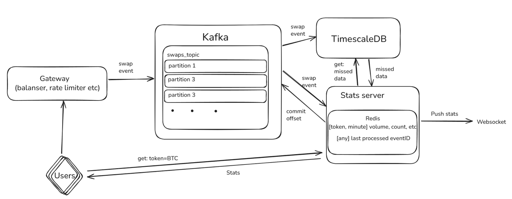

# About the Project
Generate swap -> Write to ring buffer and Redis -> Push to WebSocket  
Also, `ServeAndListen` on `localhost:8080` for stats and healthcheck.

---

# How to Start
```bash
git clone https://github.com/ShoNado/Dexcelerate_swap_stats.git
```

### Locally

```bash
go mod download
go run cmd/server/main.go
```
### Using Docker
```bash
docker compose up --build
```
### Check for Work
- http://localhost:8080/stats?token=BTC 
- http://localhost:8080/healthz 
- ws://localhost:8080/ws

```bash
curl http://localhost:8080/healthz
curl http://localhost:8080/stats?token=BTC 
curl http://localhost:8080/stats?token=WRONG_TOKEN
```

---
# Architecture



---

# Details

* The service reads swap from the producer, in this case from a buffered channel.
  In a real-world scenario, Kafka would be used since it can guarantee at-least-once delivery.
  Kafka also helps to avoid data loss: until the data is written into the database, we don’t commit the offset.

* To store trading data for the last 24 hours, we use a **ring buffer of buckets**,
  where each bucket corresponds to a specific minute, as well as **Redis** in persistent mode.
  Redis helps preserve data in case of failure and allows reloading it into memory after restart.
  To ensure atomicity, we use a **LUA script** that writes swap data into Redis.

* To avoid data loss during downtime, we can occasionally store the ID of the last processed message.
  On restart, the service queries the database for all events that occurred after that ID.
  We also add a safety margin (`lastEventID - offset`) to ensure no events are missed.

---

# Proposal for Scaling

* **Kafka**:
  Partitioning by Token for near-even distribution;
  usage of in-sync and async replicas for reliability.

* **Redis**:
  Sharding by Token + replicas for read-intensive loads;
  optionally add a layer of **virtual caches** for load distribution in case of rebase.

* **TimescaleDB (or other DB)**:
  Sharding by Token;
  partitioning of old data to reduce the active dataset size.

* **Service**:
  Multiple pods, each working with its own Kafka partition;
  for hot tokens, run identical pods but in different consumer groups.
  If even higher throughput is required, migrate from Kafka to **gRPC**.

